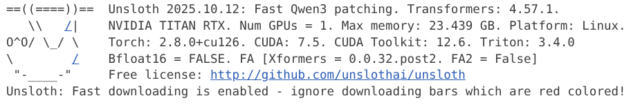
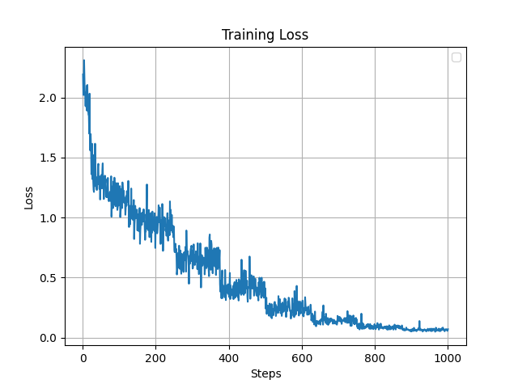

# Fine-tuning Qwen3 with Unsloth
这是一个使用 **Unsloth** 对 **qwen3** 进行微调的教程
如果你想快速入门大模型微调,希望这个repo能帮到你
我的设备配置:

## Environment Setup (环境配置)
默认您的设备已具备本地化部署Qwen3的环境,配置CUDA,Pytorch等请参考其他优秀教程.
微调使用Unsloth,Linux中需要
```bash
pip install unsloth
```
等待安装完成后,运行代码:
```python
import unsloth
```
出现以下信息表明安装成功


## Preparing the Dataset (准备数据集)

`train.jsonl`数据来源于使用[精致的医疗r1数据](https://modelscope.cn/datasets/krisfu/delicate_medical_r1_data),数据处理代码如下:

```python
import json
import random
messages = []
with open('r1_data_example.jsonl', 'r') as file:
    for line in file:
        data = json.loads(line)
        input = data['question']
        output = data['answer']
        message = {
                    "instruction": "你是一个医学专家，你需要根据用户的问题，给出专业的回答。",
                    "input": input,
                    "output": output,
                    }
        messages.append(message)

random.shuffle(messages)
train = messages[:1000]

with open('train.jsonl', 'w') as outfile:
    for message in train:
        outfile.write(json.dumps(message, ensure_ascii=False) + "\n")
```

## Training the Model (训练模型)

完整代码在`train.ipynb`中,逐步运行即可开始训练,最后记得保存模型!

## Training Results (训练结果)
可视化模型训练的loss
```python
import matplotlib.pyplot as plt

losses = [log["loss"] for log in trainer.state.log_history if "loss" in log]
steps = [log["step"] for log in trainer.state.log_history if "loss" in log]

plt.plot(steps, losses)
plt.xlabel("Steps")
plt.ylabel("Loss")
plt.title("Training Loss")
plt.legend()
plt.grid()
plt.savefig("training_loss.png")
plt.show()
```

e.g.:

看起来还可以

## Inference with the Fine-Tuned Model (推理训练好的模型)

最后,可以使用`reference.ipynb`对微调后的模型进行推理测试.


## References (相关链接)
- Training framework: [Unsloth](http://github.com/unslothai/unsloth)
- Model: [Qwen3](https://github.com/QwenLM/Qwen3) 系列模型
- Datasets: [delicate_medical_r1_data](https://modelscope.cn/datasets/krisfu/delicate_medical_r1_data)